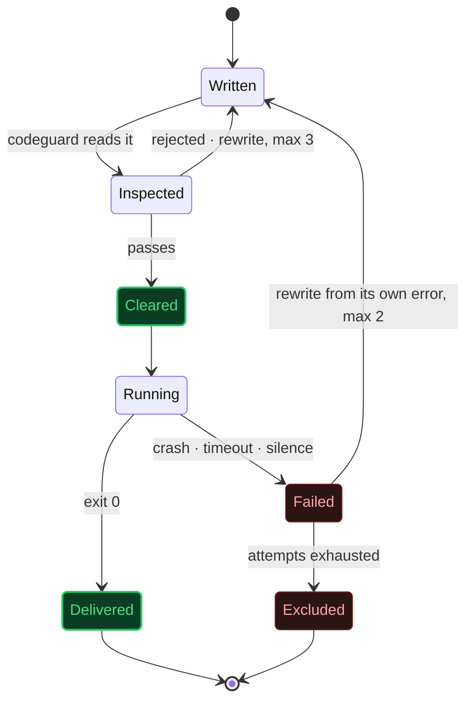

<div align="center">


# AgentGod

### One agent that writes other agents - runs them, merges their answers, and deletes them.


**[Quickstart](#quickstart)** · **[How it works](#how-it-works)** · **[See it run](#see-it-run)** · **[Safety](#containment)** · **[Config](#calibration)** · **[Architecture](ARCHITECTURE.md)**

</div>

---

## The idea, in ten seconds

You give it a task. **It does not answer you.**

It works out which specialists the task actually needs, writes each one as a
real Python file, runs them in order, feeds each the results of the last, and
merges everything into a single answer.

Then it asks whether to delete them.

```
  task ──▶ architect ──▶ writes 1–4 agents ──▶ runs them ──▶ one answer ──▶ released
```

No agent exists before you ask for it. Most no longer exist a minute later.

---

## Quickstart

```bash
git clone https://github.com/uditstocks/AgentGOD.git
cd AgentGOD
pip install -e .[rich]      # installs the `agentgod` command
```

Then run it - it will ask for your key the first time (input hidden,
verified against the API, saved to a gitignored `.env`):

```bash
agentgod
```

That is the whole setup. Prefer doing it by hand? `pip install -r
requirements.txt`, copy `.env.example` to `.env`, paste a key from
**[console.anthropic.com](https://console.anthropic.com/settings/keys)**, and
`python main.py` - both spellings are the same program. A real environment
variable outranks the file, so CI can inject the key without one.

---

## The command line

```
agentgod                                  interactive session
agentgod "write a haiku about rain"       one task, then exit
agentgod --json "compare X and Y"         machine-readable result on stdout
echo summarise this repo | agentgod -     task text from stdin
agentgod library | stats | history        the free, offline commands (no key)
agentgod --discard "one-off experiment"   run without growing the library

exit codes    0 succeeded · 1 failed · 2 bad usage · 130 interrupted
```

The streams honour the Unix contract: **the answer is stdout, everything
else is not.** Pipe or redirect a run and the progress narration moves to
stderr, so `agentgod "..." > answer.md` captures exactly the answer.
`--quiet` prints only the answer even at a terminal; `--json` emits one
object with the answer, the team, the cost, and how the run went.

Per-invocation control, no config edits: `--model`, `--effort low..max`,
`--council auto|always|off`, and `--keep` / `--discard` / `--no-input` for
scripts that must never prompt. Everything after `--task` is task text,
never a flag, so a task may safely contain the word `--json`.

When something breaks, the error says what happened and what to do - "Your
API key was rejected. Check ANTHROPIC_API_KEY in .env..." - with the raw
detail dimmed underneath, never a bare JSON dump.

---

## See it run

While a task runs, one live board shows the whole machine: which phase is
active, every agent's state, and what is happening *right now* - written,
reused, running, repairing itself, done, failed. It animates while the
system works and disappears when it is finished, leaving only the answer
and a compact transcript.

```
  ────────────────────────────────────────────────────── 22:14 ──

  PLAN  ▸  FORGE  ▸  DEPS  ▸  RUN  ▸  MERGE  ▸  CHECK      00:08
  ⠸ run  translation_agent is working  (1/2)

   ⠼  translation_agent  Translate the phrase into the      3s
   ○  summary_agent      Condense the findings              …

  ╭─  A N S W E R  ──────────────────────────────────────────╮
  │                                                          │
  │   'Good morning' is 'Bonjour' in French and              │
  │   'Guten Morgen' in German.                              │
  │                                                          │
  ╰──────────────────────────────────────────────────────────╯
  team   ●  translation_agent  built   2.8s · 61 tok
         ●  summary_agent      reused  1.5s · 85 tok
  run    10.4s · 5 LLM calls · 1,395 in / 226 out · ~$0.0003
  saved  runs/20260825_221204_translate-the-phrase.md

  ❯ Keep the 1 new agent (translation_agent) for reuse? [Keep/discard/always] (Enter = keep):
```

Pipe it, redirect it, run it in CI, or run it without `rich` installed, and
the same run degrades to clean, aligned plain text - same information, no
color, no animation, nothing that fights a log file:

```
$ agentgod --plain "In one line, name one benefit of static typing."

[1/5] Planning agents...
  - research_agent: gather facts about the benefits of static typing
  - summary_agent: condense the findings into a single line

[2/5] Generating agent code...
  reused research_agent.py (from library, free)
  reused summary_agent.py (from library, free)

[4/5] Executing agents...
  [1/2] research_agent running...
    done in 7.2s

============================================================
ANSWER
============================================================
Static typing helps catch type-related errors early, improving reliability.

22.1s · 4 LLM calls · 1,031 in / 198 out tokens · ~$0.0003
```

The pipeline itself never prints. It emits **events** (`events.py`), and the
interface (`ui.py` / `richui.py`) decides what they look like - so the same
run is a living board in a terminal and a clean transcript in a pipe.

This is `memo_writer.py` - written during that run, by the machine, verbatim:

```python
def run(task: str, previous_outputs: dict) -> str:
    analysis = previous_outputs["analysis_agent"]
    formatted_previous = format_previous(previous_outputs)

    prompt = (
        f"As a memo writer, your task is to draft a concise 200-word investor memo. "
        f"Here is the user task: {task}. "
        f"Based on the analysis provided: {analysis}, "
        f"and the previous outputs: {formatted_previous}, "
        f"please summarize the findings, highlight the main risks, "
        f"and provide a clear investment recommendation."
    )

    return call_llm(prompt)
```

No human wrote it. It ran for 6.3 seconds and was deleted.

---

## Why disposable

Most systems that call themselves *multi-agent* ship a fixed roster - a
researcher, a writer, a critic - hard-coded and permanently resident, waiting
for work whether or not the work ever arrives.

This one ships nobody.

|  | Conventional framework | AgentGod |
|---|---|---|
| **Roster** | researcher · writer · critic | empty |
| **Defined** | at install time | at the moment you ask |
| **Lifespan** | forever | one task |
| **Idle cost** | permanent | zero |
| **Author** | a human, months ago | the architect, seconds ago |

A single permanent process - the *architect* - decides the team and writes it
from nothing. It never does the work itself.

---

## How it works

```
        task
         │
         ▼
   ┌───────────┐
   │  PLANNER  │   grades the task, decides the team, and wires who feeds whom
   └─────┬─────┘
         │  1–4 specifications, as a dependency graph
         ▼
   ┌───────────┐
   │ GENERATOR │   writes every new agent - all of them at once, in parallel
   └─────┬─────┘
         │  source, per agent
         ▼
   ┌───────────┐
   │ CODEGUARD │   reads that function before it is allowed to run
   └─────┬─────┘
         │  cleared
         ▼
   ┌───────────┐
   │  EXECUTOR │   runs the graph in waves - independent agents side by side,
   └─────┬─────┘   dependent ones in strict sequence, each against a clock
         │  output - or a reason it failed
         ▼
   ┌───────────┐
   │   MERGER  │   collapses every voice into one answer
   └─────┬─────┘
         │  a finished answer
         ▼
   ┌───────────┐
   │  COUNCIL  │   deep tasks only: an adversarial critic cross-examines the
   └─────┬─────┘   answer, and real faults drive one refinement pass
         │  it survives the reading
         ▼
   ┌───────────┐
   │ JUDGEMENT │   reads it back against the request  ──┐  short?
   └─────┬─────┘                                        │  run again
         │  it holds                        ────────────┘
         ▼
    final response
         │
         ▼
   keep it, or delete it
```

Each stage does one thing and knows nothing about the others. The planner has
never seen a line of Python. The executor has never seen a prompt. A factory
line, not one mind holding the whole problem at once.

The last stage is the one that makes it an agent rather than a pipeline. A run
used to end wherever the merger happened to stop; now the answer is read back
against the request, and a 200-word brief that came out at 600 words sends the
agents round again with the gap named. Before any of it starts, an ambiguous
task earns one clarifying question - and only one, and only when there is a
person there to answer it.

Agents can also **search the web**. That runs server-side at the API, so a
generated agent stays standard-library-only and gains no new reach of its own:
it asks a question and reads an answer. What it cannot do is browse - no
logging in, no clicking through a site, no filling in a form.

---

## Where the thinking goes

Most systems spend the same effort on "translate good morning" as on "analyse
this acquisition". This one budgets like a person would.

**The planner grades every task first** - `simple`, `standard` or `deep` -
and the grade sets the reasoning effort of *every* call that follows: the
code generation, the merge, the judging, and the generated agents' own calls
at runtime. A translation stops deliberating; an analysis stops rushing. A
stronger `LLM_EFFORT` you set yourself is never lowered.

**The plan is a graph, not a queue.** The planner declares which agents feed
which, and only a proven-independent pair ever runs in parallel:

```
  wave 1     research_agent  ∥  market_data_agent      side by side
                    └───────┬───────┘
  wave 2             analysis_agent                    waits for both
                            │
  wave 3              writer_agent                     waits for the analysis
```

Everything in a wave has every input it needs before the wave starts, so
running them together is exactly as correct as running them one by one - and
a plan that is genuinely a chain still runs as a chain. Declared dependencies
are sanitised like everything else the model writes: unknown names are
dropped, a cycle is broken rather than obeyed, and a plan that declares
nothing falls back to the old safe sequence.

**Deep answers face the council.** Before the judge checks compliance, an
adversarial critic reads the merged answer the way its toughest reviewer
would - unsupported claims, reasoning that does not carry its conclusion, the
counter-case that was never weighed. Real faults drive one refinement pass
that fixes exactly what was named; a sound answer stands, unbilled. Two calls
at most, and only for tasks graded deep.

**The library keeps score on itself.** Every reused agent's run is recorded
as a win or a loss. One that has failed more tasks than it finished is
retired automatically and rebuilt fresh; a repaired agent advances a
generation and starts with a clean record. `/stats` shows the ledger.

---

## Containment

A system that writes its own workers, in a real language, and then runs them
has to answer one question before anything else: **what stops the thing it just
wrote?**

- **Names are not trusted.** Every agent identifier is reduced to a safe token
  before it goes near the filesystem. `../../../pwned` becomes `pwned`.
- **Code is not trusted.** Every generated file is parsed and inspected -
  import by import, call by call - before it is allowed to become a process.
  The whole standard library is available, minus the dozen modules that would
  undo the rest of this list: `subprocess`, `shutil`, `socket`, `pickle`,
  `importlib` and their neighbours. No `eval`. No `exec`. No shelling out.
  No writing to disk.
- **Dependencies are not trusted.** A package is installed only if it is one of
  the ~80 vetted names, and only into an isolated environment - never yours.
  An invented package name is refused rather than installed: a hallucinated
  name is a supply-chain vector, not a typo to be helpfully resolved. The list
  lives in `codeguard.ALLOWED_PACKAGES`; add to it and both the installer and
  the import check follow.
- **Time is not unlimited.** Every agent runs against a hard deadline. If it
  fails, its own error becomes the instruction for rewriting it.

The full life of one agent:



An agent that cannot be repaired is excused, named in the report, and its error
is never passed downstream as though it were a result.

> This is static validation, **not a sandbox**. Treat the task string as a trust
> boundary - don't paste untrusted text into it. Docker-per-agent is on the roadmap.

---

## The contract

Every generated agent, whatever it was built to do, obeys the same interface:

```
stdin   →  {"task": "...", "previous_outputs": {"agent_name": "...", ...}}
stdout  →  plain-text result, nothing else
stderr  →  diagnostics, plus one line of token usage
exit 0  →  success        exit ≠ 0  →  failure, with a reason
```

The keys in `previous_outputs` are never guessed at. Each agent is told, as it
is written, exactly which upstream results it will receive and under what name -
so a summarizer never reaches for data that was never going to arrive.

```mermaid
sequenceDiagram
    autonumber
    participant X as executor
    participant R as research_agent
    participant A as analysis_agent
    participant W as memo_writer
    participant M as merger

    X->>R: task · no upstream
    R-->>X: findings
    X->>A: task · research_agent
    A-->>X: risks
    X->>W: task · research_agent + analysis_agent
    W-->>X: memo

    rect rgb(11, 61, 36)
    X->>M: every output that survived
    M-->>X: one answer
    end
```



No shared memory. No message bus. Nothing travels between agents except what
the one before it actually returned.

### No framework, no install step

Generated agents import no framework and no SDK. They speak to the Messages
API directly over plain HTTPS, which is why they start instantly instead of
paying a framework import on every single run:

```diff
  COLD START · measured · Python 3.12 · Windows 11

+ stdlib agent, as shipped ....... 0.07 s   ▏
- framework import, as removed ... 5.70 s   ███████████████████████████████
                                            └── once per agent, in sequence
```

It also means an agent saved to `inventory/` still runs months later, on its
own, with nothing installed.

---

## It gets cheaper every run

An agent is written once and kept. The next task that needs the same
capability gets it back for free - no planning guess, no code generation, no
tokens. Only genuinely new capabilities cost anything.

```diff
  THREE REPORTS, THREE DIFFERENT SUBJECTS

- run 1  solar panels      6 LLM calls   3,665 in / 1,978 out   built research_agent + summary_agent
+ run 2  Brazilian coffee  4 LLM calls   2,472 in / 1,552 out   both reused, free
+ run 3  European e-bikes  4 LLM calls   2,702 in / 1,639 out   both reused, free
```

This works because generated agents are **topic-agnostic by construction**. The
generator is forbidden from writing the current subject into the agent's prompt;
the subject arrives at runtime on stdin. The `research_agent` built for solar
panels contains the word "solar" exactly zero times:

```python
def run(task: str, previous_outputs: dict) -> str:
    prompt = (
        "You are a research agent. Gather key facts for the task below.
"
        f"Task: {task}
"
        f"Previous outputs: {format_previous(previous_outputs)}"
    )
    return call_llm(prompt)
```

**You decide what gets kept.** After every run that had to build something new,
AgentGod shows you what it built and asks `keep/discard`. Nothing enters the
library without your say-so, and reused agents are never re-asked about.

The planner is shown your library before it plans, and is told to prefer an
existing name over inventing a new one. Agents live in `inventory/agents/`,
ranked by how often they have actually been used.

---

## Proof

```diff
  $ pip install pytest ruff pyright

  $ pytest
+ 599 passed

  $ ruff check .
+ All checks passed!

  $ pyright
+ 0 errors, 0 warnings
```

No test needs an API key, a network connection, or the model to be in a good
mood. Every safety claim above is asserted against a real subprocess, a real
syntax tree, and a real filesystem boundary.

---

## Calibration

Everything below has a working default. Only the key is required.

| Variable | Default | Governs |
|---|---|---|
| `ANTHROPIC_API_KEY` | - *(required)* | Access to the model |
| `MODEL` | `claude-sonnet-5` | The workhorse: planning, code, agents, merging |
| `FAST_MODEL` | `claude-haiku-4-5` | The mechanical checks - clarify and judge |
| `DEEP_MODEL` | = `MODEL` | Used only for tasks graded `deep` |
| `MAX_AGENTS` | `4` | Ceiling on team size |
| `MAX_PARALLEL_AGENTS` | `4` | How many independent agents may run at once. `1` disables parallelism |
| `COUNCIL` | `auto` | The adversarial review: `auto` (deep tasks only), `always`, `off` |
| `AGENT_TIMEOUT_SECONDS` | `300` | Hard deadline per running agent |
| `AGENT_REPAIR_ATTEMPTS` | `2` | Rewrites allowed for a crashing agent |
| `CODEGEN_ATTEMPTS` | `3` | Rewrites allowed for invalid generated code |
| `LLM_TIMEOUT_SECONDS` | `120` | Deadline for the architect's own calls |
| `LLM_MAX_TOKENS` | `8192` | Ceiling on one reply from the architect |
| `LLM_EFFORT` | `medium` | How hard the model works: `low` - `max`. Replaces temperature |
| `LLM_MAX_RETRIES` | `3` | Retries on a transient failure |
| `MAX_CHARS_PER_INPUT` | `6000` | Cap on text forwarded to the next agent |
| `TASK_REVISIONS` | `1` | Rebuilds allowed when the answer misses the request. `0` turns self-checking off |
| `WEB_SEARCH_MAX_USES` | `3` | Searches one agent call may run (each carries a fee) |
| `AGENTGOD_PLAIN` | - | Force plain output (same as `--plain`) |
| `AGENTGOD_KEEP` | - | Standing keep answer: `always` or `never` |
| `CLARIFY` | `auto` | The one pre-run question: `auto` or `off` |
| `NO_COLOR` | - | Keep the interface, strip the color |

The interface needs `rich`, but only wants it: if it is missing, every run
still works in plain text. Pipes, redirects and CI are detected and get
plain text automatically.

---

## The structure

```diff
  cli.py              the command line: flags, verbs, exit codes
  main.py             the only file that speaks to a human
  problems.py         a failure → what happened, and what to do about it
  ui.py               the presentation surface - and its plain-text fallback
  richui.py           the live interface: phase rail, agent board, panels
  events.py           the seam: the pipeline emits, the interface draws
  orchestrator.py     the architect - sequences everything, owns retries and waves
  planner.py          task → a graded team specification, wired as a graph
  taskgraph.py        the plan's shape - waves, closures, cycle-proofing
  generator.py        specification → source code
  codeguard.py        reads that source before it is trusted
  executor.py         files, subprocesses, timeouts - no model calls
  merger.py           every output → one voice
  council.py          the adversarial reading a deep answer must survive
  library.py          remembers every agent, hands it back free
  runlog.py           archives the answer to runs/
  inventory.py        clears the scratch copies

- generated_agents/   where an agent lives while it works       DISPOSABLE
+ inventory/          where an agent goes if you keep it        YOURS
  .agent_venv/        where a borrowed dependency lives         ISOLATED
```

One file, one responsibility. The reasoning behind every decision is in
**[ARCHITECTURE.md](ARCHITECTURE.md)**.

---

## Boundaries

This is not pretending to be more than it is.

Agents run in parallel only when the plan's own graph proves them independent;
everything else stays strictly sequential, because an invented ordering is
how data silently goes missing. They can look something up, but they cannot
browse: no logging in, no clicking through a site, no filling in a form. They
do not write to your files, run your code, or remember a previous run within
a task.

What is here is exact. What is not here has not been claimed.

---

<div align="center">

Every agent this system builds will eventually stop existing.

What it produces before then is yours to keep.

</div>
