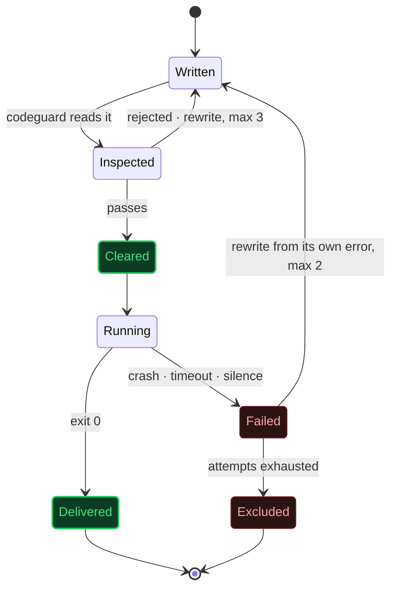

<div align="center">


# AgentGod

### One agent that writes other agents - runs them, merges their answers, and deletes them.


**[Quickstart](#quickstart)** · **[How it works](#how-it-works)** · **[See it run](#see-it-run)** · **[Safety](#containment)** · **[Config](#calibration)** · **[Architecture](ARCHITECTURE.md)**

</div>

---

## The idea, in ten seconds

You give it a task. **It does not answer you.**

It works out which specialists the task actually needs, writes each one as a
real Python file, runs them in order, feeds each the results of the last, and
merges everything into a single answer.

Then it asks whether to delete them.

```
  task ──▶ architect ──▶ writes 1–4 agents ──▶ runs them ──▶ one answer ──▶ released
```

No agent exists before you ask for it. Most no longer exist a minute later.

---

## Quickstart

```bash
git clone https://github.com/uditstocks/AgentGOD.git
cd AgentGOD
pip install -r requirements.txt
```

Get a key from **[openrouter.ai/keys](https://openrouter.ai/keys)**, then:

```bash
cp .env.example .env        # Windows:  Copy-Item .env.example .env
```

```ini
# .env
OPENROUTER_API_KEY=sk-or-...
```

```bash
python main.py
```

That is the whole setup. One key, one command. A real environment variable
outranks the file, so CI can inject the key without one.

---

## See it run

A real session. Nothing staged.

```
$ python main.py

What do you need done?
> Research the electric-scooter industry, analyse its main risks, and write
  a 200-word investor memo with a clear recommendation

[1/5] Planning agents...
  - research_agent   Gather information on the industry and its main risks.
  - analysis_agent   Analyze the gathered information and identify key risks.
  - memo_writer      Draft a 200-word investor memo with a recommendation.

[2/5] Generating agent code...
  Wrote research_agent.py
  Wrote analysis_agent.py
  Wrote memo_writer.py

[3/5] Checking dependencies...
[4/5] Executing agents...
[5/5] Merging outputs...

============================================================
FINAL RESPONSE
============================================================
### Investor Memo: Electric-Scooter Industry Overview & Recommendations

The electric-scooter industry is poised for significant growth, with
projected revenues reaching $30 billion by 2028, fueled by urbanization and
a shift towards sustainable transportation solutions. Key players include
Bird, Lime, and Spin. However, several risks could impact investment returns.
...

34.1s  ·  8 LLM calls  ·  4,106 in / 1,809 out tokens  ·  ~$0.0017

Delete the generated agents or save them to inventory? [delete/save]:
```

This is `memo_writer.py` - written during that run, by the machine, verbatim:

```python
def run(task: str, previous_outputs: dict) -> str:
    analysis = previous_outputs["analysis_agent"]
    formatted_previous = format_previous(previous_outputs)

    prompt = (
        f"As a memo writer, your task is to draft a concise 200-word investor memo. "
        f"Here is the user task: {task}. "
        f"Based on the analysis provided: {analysis}, "
        f"and the previous outputs: {formatted_previous}, "
        f"please summarize the findings, highlight the main risks, "
        f"and provide a clear investment recommendation."
    )

    return call_llm(prompt)
```

No human wrote it. It ran for 6.3 seconds and was deleted.

---

## Why disposable

Most systems that call themselves *multi-agent* ship a fixed roster - a
researcher, a writer, a critic - hard-coded and permanently resident, waiting
for work whether or not the work ever arrives.

This one ships nobody.

|  | Conventional framework | AgentGod |
|---|---|---|
| **Roster** | researcher · writer · critic | empty |
| **Defined** | at install time | at the moment you ask |
| **Lifespan** | forever | one task |
| **Idle cost** | permanent | zero |
| **Author** | a human, months ago | the architect, seconds ago |

A single permanent process - the *architect* - decides the team and writes it
from nothing. It never does the work itself.

---

## How it works

```
        task
         │
         ▼
   ┌───────────┐
   │  PLANNER  │   decides how many agents this needs, and what each is for
   └─────┬─────┘
         │  1–4 specifications
         ▼
   ┌───────────┐
   │ GENERATOR │   writes the one function each agent will execute
   └─────┬─────┘
         │  source, per agent
         ▼
   ┌───────────┐
   │ CODEGUARD │   reads that function before it is allowed to run
   └─────┬─────┘
         │  cleared
         ▼
   ┌───────────┐
   │  EXECUTOR │   runs it in isolation, against a clock
   └─────┬─────┘
         │  output - or a reason it failed
         ▼
   ┌───────────┐
   │   MERGER  │   collapses every voice into one answer
   └─────┬─────┘
         ▼
    final response
         │
         ▼
   keep it, or delete it
```

Each stage does one thing and knows nothing about the others. The planner has
never seen a line of Python. The executor has never seen a prompt. A factory
line, not one mind holding the whole problem at once.

---

## Containment

A system that writes its own workers, in a real language, and then runs them
has to answer one question before anything else: **what stops the thing it just
wrote?**

- **Names are not trusted.** Every agent identifier is reduced to a safe token
  before it goes near the filesystem. `../../../pwned` becomes `pwned`.
- **Code is not trusted.** Every generated file is parsed and inspected -
  import by import, call by call - before it is allowed to become a process.
  No `eval`. No `exec`. No shelling out. No writing to disk. Anything outside a
  vetted set of imports is refused, not warned about.
- **Dependencies are not trusted.** A package is installed only if it is on an
  explicit allowlist, and only into an isolated environment - never yours.
- **Time is not unlimited.** Every agent runs against a hard deadline. If it
  fails, its own error becomes the instruction for rewriting it.

The full life of one agent:



An agent that cannot be repaired is excused, named in the report, and its error
is never passed downstream as though it were a result.

> This is static validation, **not a sandbox**. Treat the task string as a trust
> boundary - don't paste untrusted text into it. Docker-per-agent is on the roadmap.

---

## The contract

Every generated agent, whatever it was built to do, obeys the same interface:

```
stdin   →  {"task": "...", "previous_outputs": {"agent_name": "...", ...}}
stdout  →  plain-text result, nothing else
stderr  →  diagnostics, plus one line of token usage
exit 0  →  success        exit ≠ 0  →  failure, with a reason
```

The keys in `previous_outputs` are never guessed at. Each agent is told, as it
is written, exactly which upstream results it will receive and under what name -
so a summarizer never reaches for data that was never going to arrive.

```mermaid
sequenceDiagram
    autonumber
    participant X as executor
    participant R as research_agent
    participant A as analysis_agent
    participant W as memo_writer
    participant M as merger

    X->>R: task · no upstream
    R-->>X: findings
    X->>A: task · research_agent
    A-->>X: risks
    X->>W: task · research_agent + analysis_agent
    W-->>X: memo

    rect rgb(11, 61, 36)
    X->>M: every output that survived
    M-->>X: one answer
    end
```



No shared memory. No message bus. Nothing travels between agents except what
the one before it actually returned.

### Standard library only

Generated agents import nothing. They speak to the model directly over plain
HTTPS, which is why they start instantly instead of paying a framework import
on every single run:

```diff
  COLD START · measured · Python 3.12 · Windows 11

+ stdlib agent, as shipped ....... 0.07 s   ▏
- framework import, as removed ... 5.70 s   ███████████████████████████████
                                            └── once per agent, in sequence
```

It also means an agent saved to `inventory/` still runs months later, on its
own, with nothing installed.

---

## Proof

```diff
  $ pip install pytest ruff pyright

  $ pytest
+ 119 passed

  $ ruff check .
+ All checks passed!

  $ pyright
+ 0 errors, 0 warnings
```

No test needs an API key, a network connection, or the model to be in a good
mood. Every safety claim above is asserted against a real subprocess, a real
syntax tree, and a real filesystem boundary.

---

## Calibration

Everything below has a working default. Only the key is required.

| Variable | Default | Governs |
|---|---|---|
| `OPENROUTER_API_KEY` | - *(required)* | Access to the model |
| `MODEL` | `openai/gpt-4o-mini` | Any chat model OpenRouter can reach |
| `MAX_AGENTS` | `4` | Ceiling on team size |
| `AGENT_TIMEOUT_SECONDS` | `300` | Hard deadline per running agent |
| `AGENT_REPAIR_ATTEMPTS` | `2` | Rewrites allowed for a crashing agent |
| `CODEGEN_ATTEMPTS` | `3` | Rewrites allowed for invalid generated code |
| `LLM_TIMEOUT_SECONDS` | `60` | Deadline for the architect's own calls |
| `LLM_MAX_RETRIES` | `3` | Retries on a transient failure |
| `MAX_CHARS_PER_INPUT` | `6000` | Cap on text forwarded to the next agent |

---

## The structure

```diff
  main.py             the only file that speaks to a human
  orchestrator.py     the architect - sequences everything, owns retries
  planner.py          task → team specification (and the security boundary)
  generator.py        specification → source code
  codeguard.py        reads that source before it is trusted
  executor.py         files, subprocesses, timeouts - no model calls
  merger.py           every output → one voice
  inventory.py        delete, or remember

- generated_agents/   where an agent lives while it works       DISPOSABLE
+ inventory/          where an agent goes if you keep it        YOURS
  .agent_venv/        where a borrowed dependency lives         ISOLATED
```

One file, one responsibility. The reasoning behind every decision is in
**[ARCHITECTURE.md](ARCHITECTURE.md)**.

---

## Boundaries

This is not pretending to be more than it is.

Agents run in sequence, not in parallel - there is an order here, not yet a
scheduler. None of them carries a tool, browses the open web, or remembers a
previous run. A team saved to `inventory/` is an archive, not yet a library;
nothing is reused automatically.

What is here is exact. What is not here has not been claimed.

---

<div align="center">

Every agent this system builds will eventually stop existing.

What it produces before then is yours to keep.

</div>
